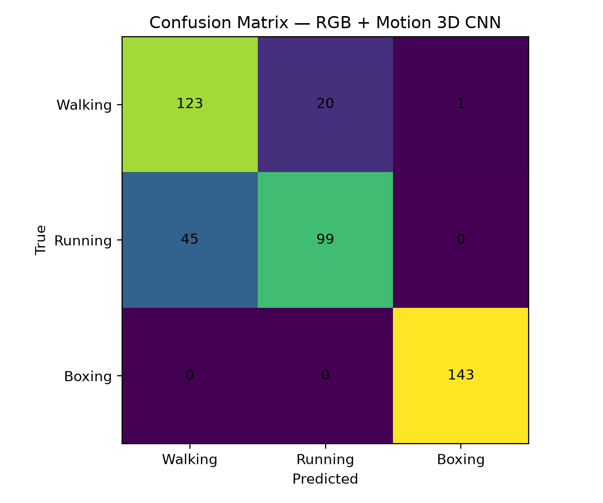
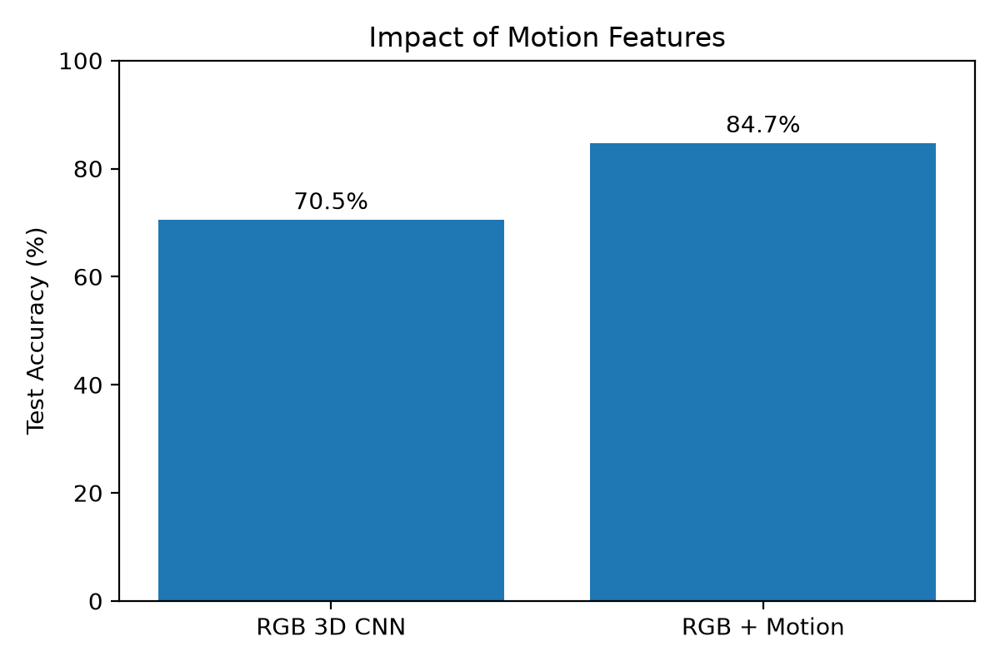
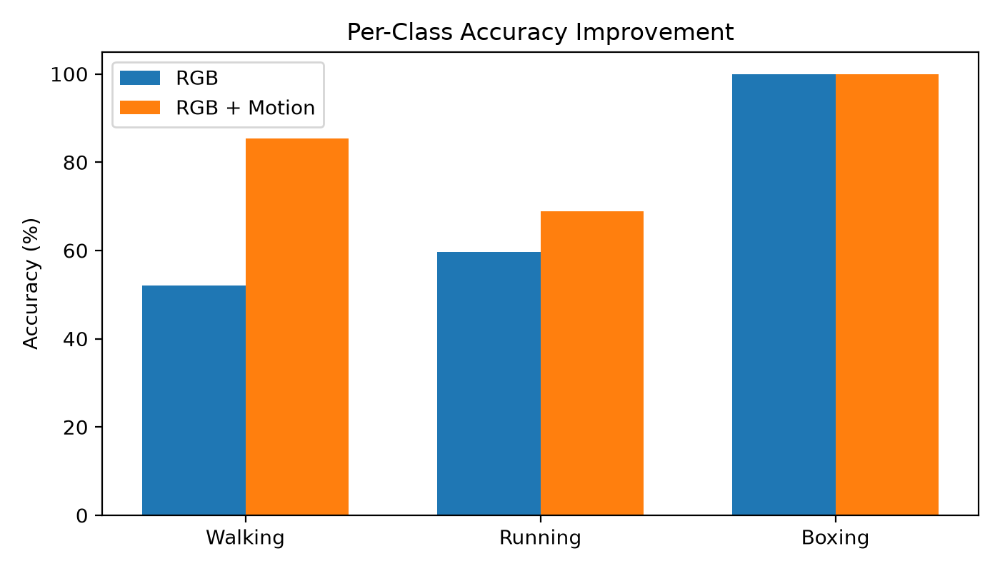

# Human Action Recognition from Scratch

A video action recognition project built from scratch with PyTorch using the KTH Human Actions dataset.

## Goal

Train a 3D CNN to classify three actions:

- Walking
- Running
- Boxing

The model is evaluated on unseen subjects using the official KTH subject-wise split.

## Approach

### Baseline
A simple 3D CNN trained directly on RGB video frames.

**Test accuracy: 70.5%**

### Motion-aware model
Error analysis showed that the baseline frequently confused walking and running.

To make motion more explicit, temporal frame differences were added as three additional channels:

- 3 RGB channels
- 3 motion-difference channels

The first 3D convolution therefore receives 6 channels.

**Test accuracy: 84.7%**

This represents a **+14.2 percentage-point improvement**.

## Results

| Model | Test Accuracy |
|---|---:|
| RGB 3D CNN | 70.5% |
| RGB + Motion 3D CNN | **84.7%** |

### Confusion Matrix

### Impact of Motion Features

### Per-Class Accuracy

## Final per-class performance

| Class | Accuracy |
|---|---:|
| Walking | 85.4% |
| Running | 68.8% |
| Boxing | 100.0% |

The main remaining difficulty is distinguishing **running from walking**.

## Dataset

KTH Human Actions dataset.

Instead of treating each AVI file as one training example, the official sequence annotations were used to extract individual action segments.

Official subject-wise train/validation/test splits were used.

## Model

Small 3D CNN trained from random initialization:

- 3D convolutions
- ReLU activations
- 3D max pooling
- Adaptive average pooling
- Linear classifier

No pretrained model was used.

## Tech Stack

- Python
- PyTorch
- OpenCV
- NumPy
- Matplotlib

## Key Takeaway

Explicit motion information substantially improved generalization.

The RGB-only model achieved 70.5% accuracy, while adding frame-difference motion channels increased test accuracy to 84.7%.